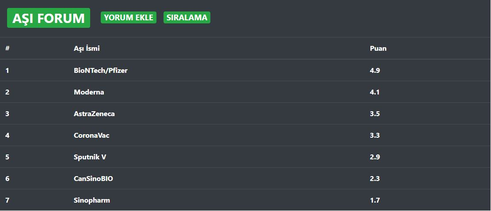

# Vaccine Forum

React application that shows the comments and side effects about corona vaccines. You can add comment, side effects. You can see avarage rating of vaccines given score.

Korona aşıları ile ilgili yorumları ve yan etkileri gösteren React uygulaması. Yorum, yan etkiler ekleyebilirsiniz. Puan verilen aşıların genel derecelendirmesini görebilirsiniz.

#To Run(React should be installed)

change directory to api and write "json-server --watch vaccine.json" to terminal

change directory asi-forum and write "npm start" to terminal

#Çalıştırmak için(React yüklü olmalıdır)

Dosya yolunu api olarak değiştirin ve terminale "json-server --watch vaccine.json" yazın

Dosya yolunu asi-forum olarak değiştirin ve terminale "npm start" yazın

#UI - Arayüz

  

This is the main page of vaccine page. You can click vaccines from the vaccines list that will list comments and side effects about that vaccine. 

Bu, aşı sayfasının ana sayfasıdır. Aşılar listesinden, o aşı hakkındaki yorumları ve yan etkileri listeleyen aşılara tıklayabilirsiniz.

  

You can add comment from this page.

Bu sayfadan yorum ekleyebilirsiniz.

  

You can see the average score of vaccines on this page.

Bu sayfadan aşıların puan ortalamalarını görebilirsiniz.
